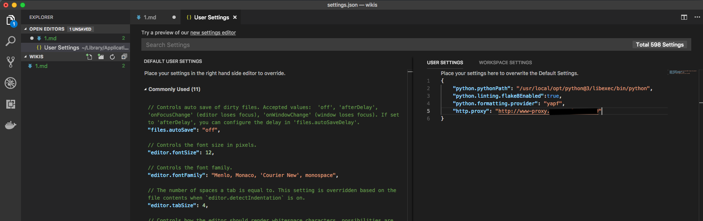

# How to setup Proxy settings in Visual Studio Code

由于某些原因我们无法直接访问internet网络，所以导致无法安装或是升级Visual Studio Code的extension。 可以通过在VS Code中配置proxy来解决，这一切修改都是在User Settings中。通过*Code-->Preference-->Settings*或是按*Command+Shift+P* 打开User Settings选择Open User Settings, 添加http.proxy.

