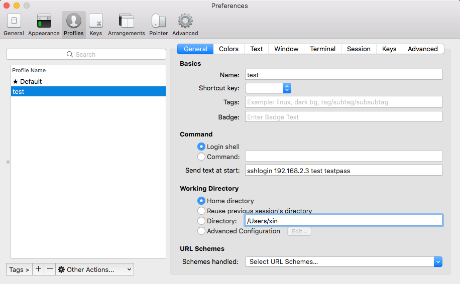

# iTerm2实现ssh免密码输入登录
Iterm2是Mac下流行的SSH客户端工具，默认情况下无法像其他ssh管理工具[xshell](https://www.netsarang.com/products/xsh_overview.html)或者[secureCRT](https://www.vandyke.com/products/securecrt/)记录登录密码，在ssh登录到服务器时仍需输入密码。现在，我们可以通过expect脚本实现SSH免密码登陆。

** 第一步：**  在Mac上安装expect
```bash
$brew install expect
```

** 第二步：** 编写expect脚本
```bash
#!/usr/bin/expect
# file name :sshlogin.sh
# Usages : ./sshlogin.sh host username passworld
# Ssh to host without interaction for input password

# Check the number of passed parameters
if { $argc != 3 } {
    send_user "Usage:login.sh hostname username password\n"
    exit
}

set host [lindex $argv 0]
set user [lindex $argv 1]
set pass [lindex $argv 2]

spawn ssh -o StrictHostKeyChecking=no ${user}@${host}
#send_user "ssh -o StrictHostKeyChecking=no ${user}@${host}"

# expect 开始
#expect "*user*" { send ${user}\r }
expect "*password:" { send ${pass}\r }

interact
#EOF
```

如上面代码所示，执行该脚本需要传递三个参数，登录的主机hostname或IP，用户名及密码，例如./sshlogin.sh 192.168.2.3 oracle oraclepass.

** 第三步：** 在iTerm2中配置新的Profile
为了在配置Profile时免去输入sshlogin.sh脚本的全路径，我们为sshlogin.sh添加alias，方法很简单，在~/.bash_profile中添加如下内容:

```bash
alias sshlogin="~/Codes/mac_xin/item2_dynprop/sshlogin.sh"
```

在iTerm2中，依次选择iTerm2 -> Preferences -> Profiles建立一个新的profile，如下图，在Command中填入内容：
```bash
sshlogin 192.168.3.15 test password
```




